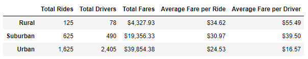
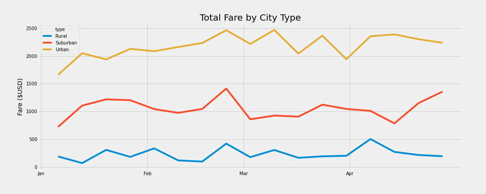

# PyBer_Analysis 
## Overview of Analysis:
In order to properly advise the CEO of PyBer on future business decisions, a need has been identified to create a visualization of ride sharing data categorized by city type **(Urban, Suburban, and Rural)**. Ride sharing data will be gathered from CSV documents *(city_data.csv/ride_data.csv)*. The data will then be merged into one data set, cleaned, and parsed by city type for analysis. The data will be summarized in a formatted data table. Through the usage of *Pandas* and *Matplotlib*, the data will also be visualized in a multiple-line graph based on a pivot table of data sampled from **January 1, 2019** to **April 29, 2019**. Following the visualizations will be a written analysis with business recommendations adressing any disparities between city types.

## Results:

A brief look at the data for **1/1/19** - **4/29/19** reveals several key details:
* **Rural** cities account for:
    - Least amount of rides **(125)**
    - Least amount of drivers **(78)**
    - Least total fares **($4,327.93)**
    - Highest average fare per ride **($34.62)**
    - Highest average fare per driver **($55.49)**
    
        **NOTE**: There is **~1.6** rides per driver in **Rural** cities.

* **Urban** cities account for: 
    - Most amount of rides **(1,625)**
    - Most amount of drivers **(2,405)**
    - Highest total fares **($39,854.38)**
    - Lowest average fare per ride **($24.53)**
    - Lowest average fare per driver **($16.57)**

        **NOTE**: There is **~.7** rides per driver in **Urban** cities. 

* **Suburban** cities fall just below the average for each of the observed values.
    - **NOTE**: There is **~1.3** rides per driver in **Suburban** cities.
 
 

### Take-Aways from Total Fare by City Type Over Time
* **Urban** cities on average net over **$2000.00** a day from **Feb 1** to **Apr 29** with a predictable variance of approx. **+/- $250.00**
* **Suburban** cities average approx. **$1050.00** a day from **Feb 1** to **Apr 29** with slightly more variance than **Urban** cities.
* **Rural** cities average rarely reaches above **$400.00** a day with negligible in average traffic as the year progresses. 

## Summary: 
Based on the results, it is recommended that PyBer runs more promotions to increase the number of rides in Urban areas. Averages indicate a surplus of drivers in Urban areas which results in lower fare prices paid by customers. Using data to support promotions and prove savings versus other ride-sharing platforms would likely lead to a surge of users switching over to PyBer as their choice ride-sharing service. In the event of a rise in rides, the average driver will see an increase in traffic resulting in additional income; thus adding to the incentive to start/keep driving for PyBer. 

Populations by nature diffuse away from highly populated cities. It is recommended that PyBer runs promotions in Suburban areas for rides to attractions or events in Urban areas to bring clients into areas with more drivers. When Suburban customers in Urban areas look for a ride home, they are more likely to get service home with less wait time. The popularity of PyBer as a safe mode of transportation to and from Suburban areas will increase, increasing the number of drivers in Suburban areas and bringing in more average income to these drivers due to the natue of the further trips from Suburban to Urban areas.

Rural areas by nature hold less population in a much larger area. Individuals in Rural areas are also more likely to have their own mode of transportation as a result of the longer distances between population centers. This distance increases the average fare price, while the number of vehicles per household decreases the likelihood of individuals seeing PyBer as an affordable mode of transportation. Rather than lower ride prices across the board in Rural areas, it is advised that PyBer runs weekend promotional deals for transport to and from local events and gathering places, branding the campaign as an effort to cut down on driving under the influence. An increase in demand for drivers on weekends will conversely lead to more individuals seeing PyBer as a viable opporitunity for work. The wholesome branding of this campain will result in a higher likelihood of word-of-mouth advertisement in schools, churches, and gathering places alike. 
